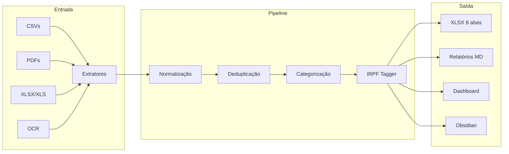

<div align="center">


# Protocolo Ouroboros

Pipeline ETL financeiro pessoal com dashboard interativo e integração Obsidian.


[](https://github.com/AndreBFarias/protocolo-ouroboros/actions/workflows/ci.yml)


</div>

---

### Quick Start

```bash
git clone git@github.com:[REDACTED]/protocolo-ouroboros.git
cd protocolo-ouroboros
./install.sh
./run.sh
```

O menu interativo guia todas as operações: processamento, dashboard, relatórios, integração Obsidian e validação.

---

### Para colaboradores AI (Claude, Codex, Cursor, etc.)

Se você é uma sessão de modelo de linguagem trabalhando no projeto, **leia `CLAUDE.md` na raiz primeiro**. Ele declara os 3 documentos canônicos que devem ser lidos antes de criar qualquer sprint, a filosofia central (ciclo de graduação Opus -> ETL), as ferramentas (`scripts/dossie_tipo.py`) e as regras invioláveis (acentuação PT-BR, zero emojis, zero menções a IA).

O projeto se autogerencia via dossiês por tipo documental. Toda spec que toca extrator/ingestor/linker de um tipo segue o ritual artesanal de 6 fases descrito em `docs/CICLO_GRADUACAO_OPERACIONAL.md`.

---

### Sobre

Consolida dados bancários de múltiplas fontes (CSVs, XLSX, XLS, PDFs protegidos, imagens via OCR) em um XLSX unificado com 8 abas, relatórios mensais em Markdown e dashboard Streamlit com 42 páginas interativas.

| Transações | Meses | Bancos | Regras | Tags IRPF | Pytest | Tipos GRADUADOS |
|:----------:|:-----:|:------:|:------:|:---------:|:------:|:---------------:|
| 6.086 | 82 | 6 | 111 | 164 | 3.145 | 9/22 |

---

### Arquitetura



---

### Funcionalidades

| Categoria | Funcionalidade |
|-----------|---------------|
| Extração | 22 extratores: 9 bancários (Nubank cartão/CC, C6 CC/cartão, Itaú, Santander, OFX Nubank PF/PJ, energia OCR) + 13 documentais (NFCe, DANFE, XML NFe, boleto, cupom térmico foto, cupom garantia estendida, receita médica, garantia fabricante, recibo não-fiscal, DAS PARCSN, DIRPF, contracheque, garantia fabricante) |
| Detecção | Identifica banco, tipo, pessoa (CPF+CNPJ+razão social+alias) e período pelo conteúdo do arquivo |
| Categorização | 111 regras regex + overrides manuais + categorias_item.yaml. Sugestor TF-IDF para "Outros" no dashboard (página `categorizer_sugestoes`) — auditoria de ruído pendente |
| Deduplicação | 3 níveis: UUID, hash 4-tuple `(data, valor, local_normalizado, banco_origem)` cross-source (sprint INFRA-DEDUP-NIVEL-2-INCLUI-BANCO), pares de transferência + canonicalizer variantes curtas |
| IRPF | 22 regras declarativas em `mappings/irpf_regras.yaml` (5 tipos fiscais) + 75/164 tags com CNPJ/CPF |
| Dashboard | 42 páginas interativas com tema Dracula em 5 clusters. Cluster Sistema com 6 abas (Skills D7, Styleguide, Graduação, Propostas, Tipos por detectar, Sugestor Outros) |
| Relatórios | Mensais em Markdown com diagnóstico comparativo (variação vs mês-1 e média móvel) + resumo narrativo heurístico PT-BR + alertas de anomalia |
| Grafo de conhecimento | SQLite 7.639 nodes / 25.024 edges. 52 documentos catalogados: 24 holerites + 19 DAS + 3 cupom_fiscal_foto + 2 NFCe + 2 boletos + 1 DIRPF + 1 PIX |
| Ciclo de graduação | 9/22 tipos GRADUADOS (boleto, cupom_fiscal_foto, cupom_garantia_estendida, das_parcsn, extrato_bancario, fatura_cartao, holerite, nfce_consumidor_eletronica, comprovante_pix_foto). 13 tipos PENDENTES — gargalo é coleta humana de amostras |
| Validação | `make anti-migue` (lint + smoke + test). Pytest 3145 passed. `make smoke` 10/10 contratos aritméticos. `make metricas` regenera métricas vivas. `make auditoria-xlsx` cruza Opus × ETL × Graduação em planilha de auditoria |
| Concorrência | Lockfile `fcntl.flock` em `data/.pipeline.lock` (sprint INFRA-CONCORRENCIA-PIDFILE). Defesa em camadas: bash flock + python Lockfile + toast no dashboard |
| Backup | Snapshot automático do grafo antes de cada `--tudo` (sprint INFRA-BACKUP-GRAFO-AUTOMATIZADO). Retenção 7d + 1/semana das 4 semanas anteriores. `./run.sh --restore-grafo <ts>` reverte |
| Obsidian | Sincronização bidirecional com vault `Controle de Bordo` (forbidden zones ADR-18; soberania humana via tag + frontmatter) |
| OCR | Leitura de contas de energia via Tesseract + cache OCR multimodal Opus para cupons fiscais/PIX/holerites |

---

### Uso

**Menu interativo:**

```bash
./run.sh
```

**Comandos diretos:**

```bash
./run.sh --tudo            # Processa todos os dados
./run.sh --mes 2026-04     # Processa um mês específico
./run.sh --inbox           # Processa arquivos do inbox
./run.sh --dashboard       # Abre o dashboard Streamlit
./run.sh --relatorio       # Gera relatório do mês atual
./run.sh --sync            # Sincroniza com Obsidian
./run.sh --check           # Health check
./run.sh --irpf 2026       # Gera pacote IRPF
./run.sh --gauntlet        # Executa gauntlet de testes
```

**Via Makefile:**

```bash
make help                  # Lista todos os comandos
make install               # Setup completo
make process               # Pipeline completo
make dashboard             # Abre dashboard Streamlit
make lint                  # Verifica código (ruff + acentuação + cobertura D7)
make smoke                 # Health check + 10 contratos aritméticos
make anti-migue            # Gate dos 9 checks (lint + smoke + test)
make gauntlet              # Gauntlet de testes
make metricas              # Regenera data/output/metricas_prontidao.json + tabela ROADMAP
make estado-atual-atualizar # Regenera bloco de métricas vivas em ESTADO_ATUAL.md
make auditoria-xlsx        # Gera XLSX cruzando Opus × ETL × Graduação
make graduados             # Tabela viva dos tipos canônicos
make spec NOME=meu-id      # Cria spec do template
```

**Scripts CLI úteis:**

```bash
# Ciclo de graduação por tipo documental:
.venv/bin/python scripts/dossie_tipo.py listar-tipos
.venv/bin/python scripts/dossie_tipo.py abrir <tipo>
.venv/bin/python scripts/dossie_tipo.py comparar <tipo> <sha256>

# Análise:
.venv/bin/python -m scripts.exportar_auditoria_cruzada    # Auditoria Opus × ETL
.venv/bin/python -m scripts.sugerir_categorias            # TF-IDF para "Outros"
.venv/bin/python -m scripts.detectar_tipos_novos          # Tipos novos em _classificar/
.venv/bin/python scripts/diagnosticar_linking.py          # Diagnóstico documento → transação
```

---

### Estrutura do Projeto

```
protocolo-ouroboros/
├── run.sh                        # Entrypoint CLI com menu interativo
├── install.sh                    # Setup completo (venv + deps + tesseract)
├── Makefile                      # Targets automatizados
├── assets/
│   └── icon.png                  # Logo do projeto
│
├── src/
│   ├── pipeline.py               # Orquestrador principal (11 passos)
│   ├── inbox_processor.py        # Detecção, renomeação e organização
│   ├── extractors/               # 22 extratores (9 bancários + 13 documentais)
│   ├── transform/                # Categorização, deduplicação, IRPF
│   ├── load/                     # XLSX writer + relatórios MD
│   ├── projections/              # Cenários financeiros
│   ├── dashboard/                # Streamlit app (6 páginas, tema Dracula)
│   ├── obsidian/                 # Sincronização com vault
│   └── utils/                    # Logger, PDF reader, validador
│
├── mappings/                     # Regras YAML (categorias, overrides, metas)
├── data/                         # Dados financeiros (no .gitignore)
├── docs/                         # Arquitetura, ADRs, sprints, armadilhas
└── scripts/                      # Gauntlet de testes e pre-commit
```

<!-- Screenshots do dashboard aqui -->

---

### Tecnologias

| Tecnologia | Uso |
|-----------|-----|
| Python 3.11+ | Linguagem principal |
| pandas | Manipulação de dados tabulares |
| pdfplumber | Extração de texto de PDFs |
| openpyxl | Leitura/escrita de XLSX |
| xlrd + msoffcrypto-tool | Leitura de XLS encriptados |
| Tesseract OCR | Leitura de imagens (contas de energia) |
| Streamlit | Dashboard interativo |
| Plotly | Gráficos e visualizações |
| rich | Logging formatado no terminal |
| PyYAML | Configuração de regras |
| ruff | Linting e formatação |

---

### Documentação

| Documento | Descrição |
|-----------|-----------|
| [CLAUDE.md](CLAUDE.md) | Instruções completas para agentes de IA |
| [GSD.md](GSD.md) | Onboarding rápido (Get Stuff Done) |
| [ARCHITECTURE.md](docs/ARCHITECTURE.md) | Diagrama de fluxo e componentes |
| [ARMADILHAS.md](docs/ARMADILHAS.md) | Bugs críticos e soluções |
| [AUDITORIA_SPRINTS.md](docs/AUDITORIA_SPRINTS.md) | Auditoria de cada sprint |
| [CHANGELOG.md](CHANGELOG.md) | Histórico de mudanças |
| [CONTRIBUTING.md](CONTRIBUTING.md) | Guia de contribuição |
| [DADOS_FALTANTES.md](DADOS_FALTANTES.md) | Checklist de dados pendentes |

---

### Licença

Distribuído sob a licença GPLv3. Veja [LICENSE](LICENSE) para detalhes.

---

<div align="center">

*"A frugalidade inclui todas as outras virtudes." -- Cícero*

</div>
