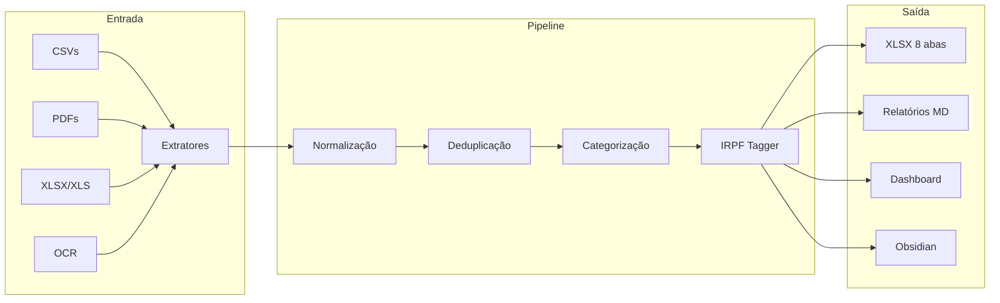

<div align="center">


# Protocolo Ouroboros

Pipeline ETL financeiro pessoal com dashboard interativo e integração Obsidian.


</div>

---

### Quick Start

```bash
git clone git@github.com:[REDACTED]/protocolo-ouroboros.git
cd protocolo-ouroboros
./install.sh
./run.sh
```

O menu interativo guia todas as operações: processamento, dashboard, relatórios, integração Obsidian e validação.

---

### Sobre

Consolida dados bancários de múltiplas fontes (CSVs, XLSX, XLS, PDFs protegidos, imagens via OCR) em um XLSX unificado com 8 abas, relatórios mensais em Markdown e dashboard Streamlit com visualizações interativas.

---

### Arquitetura



---

### Funcionalidades

| Categoria | Funcionalidade |
|-----------|---------------|
| Extração | 7 extratores (Nubank, C6, Itaú, Santander, Neoenergia OCR) |
| Detecção | Identifica banco, tipo, pessoa e período pelo conteúdo do arquivo |
| Categorização | 111 regras regex + 10 overrides manuais (100% de cobertura) |
| Deduplicação | 3 níveis: UUID, hash cross-source, pares de transferência |
| IRPF | 21 regras de tagging automático em 5 tipos fiscais |
| Dashboard | 6 páginas interativas com tema Dracula |
| Relatórios | Relatórios mensais com badges, Mermaid charts e barras Unicode |
| Validação | 6 checagens de integridade + gauntlet automatizado |
| Obsidian | Sincronização automática com vault pessoal |
| OCR | Leitura de contas de energia via Tesseract (valores R$ 100% precisos) |

---

### Uso

**Menu interativo:**

```bash
./run.sh
```

**Comandos diretos:**

```bash
./run.sh --tudo            # Processa todos os dados
./run.sh --mes 2026-04     # Processa um mês específico
./run.sh --inbox           # Processa arquivos do inbox
./run.sh --dashboard       # Abre o dashboard Streamlit
./run.sh --relatorio       # Gera relatório do mês atual
./run.sh --sync            # Sincroniza com Obsidian
./run.sh --check           # Health check
./run.sh --irpf 2026       # Gera pacote IRPF
./run.sh --gauntlet        # Executa gauntlet de testes
```

**Via Makefile:**

```bash
make help        # Lista todos os comandos
make install     # Setup completo
make process     # Pipeline completo
make dashboard   # Abre dashboard Streamlit
make lint        # Verifica código (ruff)
make gauntlet    # Executa gauntlet de testes
```

---

### Estrutura do Projeto

```
protocolo-ouroboros/
├── run.sh                        # Entrypoint CLI com menu interativo
├── install.sh                    # Setup completo (venv + deps + tesseract)
├── Makefile                      # Targets automatizados
├── assets/
│   └── icon.png                  # Logo do projeto
│
├── src/
│   ├── pipeline.py               # Orquestrador principal (11 passos)
│   ├── inbox_processor.py        # Detecção, renomeação e organização
│   ├── extractors/               # 7 extratores bancários
│   ├── transform/                # Categorização, deduplicação, IRPF
│   ├── load/                     # XLSX writer + relatórios MD
│   ├── projections/              # Cenários financeiros
│   ├── dashboard/                # Streamlit app (6 páginas, tema Dracula)
│   ├── obsidian/                 # Sincronização com vault
│   └── utils/                    # Logger, PDF reader, validador
│
├── mappings/                     # Regras YAML (categorias, overrides, metas)
├── data/                         # Dados financeiros (no .gitignore)
├── docs/                         # Arquitetura, ADRs, sprints, armadilhas
└── scripts/                      # Gauntlet de testes e pre-commit
```

<!-- Screenshots do dashboard aqui -->

---

### Tecnologias

| Tecnologia | Uso |
|-----------|-----|
| Python 3.11+ | Linguagem principal |
| pandas | Manipulação de dados tabulares |
| pdfplumber | Extração de texto de PDFs |
| openpyxl | Leitura/escrita de XLSX |
| xlrd + msoffcrypto-tool | Leitura de XLS encriptados |
| Tesseract OCR | Leitura de imagens (contas de energia) |
| Streamlit | Dashboard interativo |
| Plotly | Gráficos e visualizações |
| rich | Logging formatado no terminal |
| PyYAML | Configuração de regras |
| ruff | Linting e formatação |

---

### Documentação

| Documento | Descrição |
|-----------|-----------|
| [CLAUDE.md](CLAUDE.md) | Instruções completas para agentes de IA |
| [GSD.md](GSD.md) | Onboarding rápido (Get Stuff Done) |
| [ARCHITECTURE.md](docs/ARCHITECTURE.md) | Diagrama de fluxo e componentes |
| [ARMADILHAS.md](docs/ARMADILHAS.md) | Bugs críticos e soluções |
| [AUDITORIA_SPRINTS.md](docs/AUDITORIA_SPRINTS.md) | Auditoria de cada sprint |
| [CHANGELOG.md](CHANGELOG.md) | Histórico de mudanças |
| [CONTRIBUTING.md](CONTRIBUTING.md) | Guia de contribuição |
| [DADOS_FALTANTES.md](DADOS_FALTANTES.md) | Checklist de dados pendentes |

---

### Licença

Distribuído sob a licença MIT. Veja [LICENSE](LICENSE) para detalhes.

---

<div align="center">

*"A frugalidade inclui todas as outras virtudes." -- Cícero*

</div>
