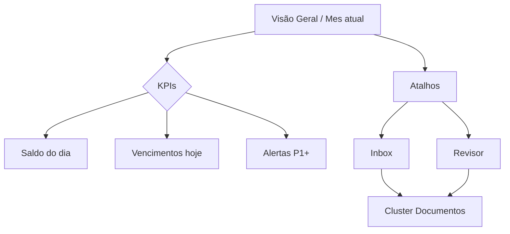
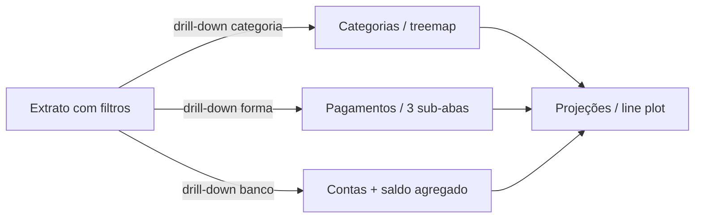
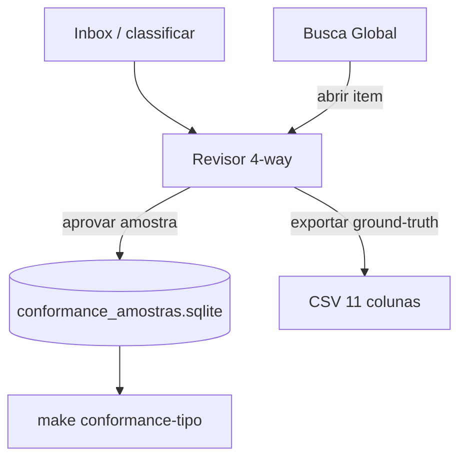
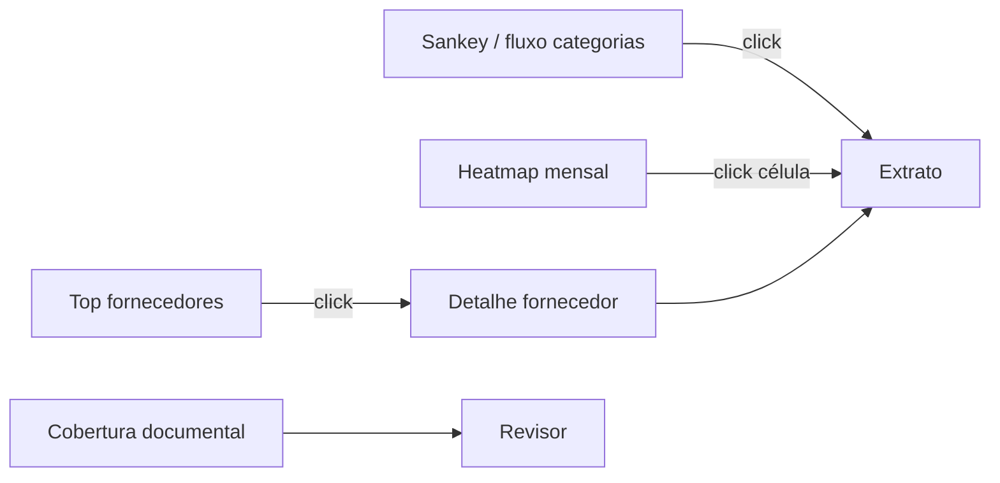
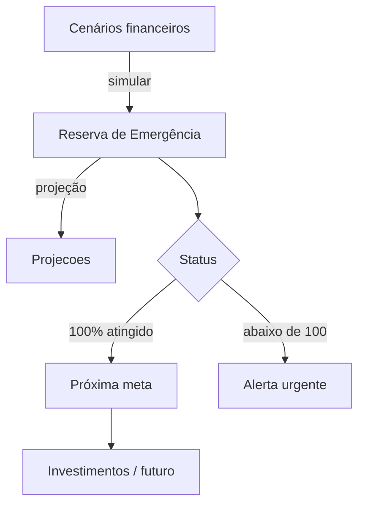
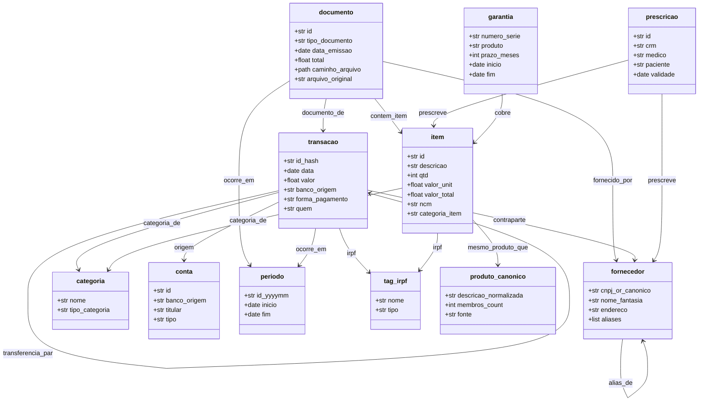

# BLUEPRINT_VIDA_ADULTA — Catálogo de outputs, documentos e relacionamentos

> **Origem:** Sprint DESIGN-01 do plan `pure-swinging-mitten` (auditoria honesta 2026-04-29).
> **Status:** v1 redigido em 2026-04-28 a partir de decisões do dono.
> **Decisão arquitetural:** Ouroboros é a **Central de Controle de Vida Adulta** do casal André + Vitória, organizando 8 domínios em torno do grafo SQLite, do XLSX consolidado e do dashboard Streamlit. Nenhuma sprint de extrator novo (DOC-*) ou aba nova (OMEGA-*) deve ser planejada sem citar a seção correspondente deste documento.

---

## §1 — Catálogo de tipos esperados por pessoa por domínio

Convenção PII: `[A]` = André, `[V]` = Vitória, `[C]` = Casal, `[*]` = qualquer um. Quando o doc é digital + físico, o canônico é digital.

### Domínio 1 — Financeiro (cobertura atual: 100%)

| Tipo | Pessoa | Origem | Status implementação | Sprint canônica |
|------|--------|--------|---------------------|-----------------|
| Extrato CC Itaú | [A] | PDF protegido | extrator maduro | (legado, Sprint 02) |
| Fatura Santander Elite | [A] | PDF | maduro | (legado) |
| Extrato C6 CC + cartão | [A] | XLS encriptado | maduro | (legado) |
| Cartão Nubank | [A] | CSV | maduro | (legado) |
| Conta Corrente Nubank PF | [V] | CSV | maduro | (legado) |
| MEI Nubank PJ | [V] | CSV | maduro | (legado) |
| Holerite G4F | [A] | PDF | maduro | (Sprint 03 + 90a) |
| Holerite Infobase | [A] | PDF | maduro | (legado) |
| Bolsa NEES/UFAL | [V] | extrato bancário (inferido) | maduro | (legado) |
| DAS PARCSN | [A] | PDF gov.br | maduro | Sprint P1.1 |
| DAS MEI ativo | [V] | PDF gov.br | maduro | (mesmo extrator P1.1) |
| DIRPF .DEC | [A] | binário fixed-width | maduro (MVP) | Sprint P3.1 |
| DIRPF .DEC | [V] | binário fixed-width | igual | igual |
| Comprovante PIX (foto) | [*] | JPEG/PNG | **gap** | Onda 3 — DOC-novo |
| Pedido Amazon | [*] | HTML/PDF | **gap** | DOC-01 |
| NF mercado físico | [*] | papel fotografado | maduro | (Sprint 45) |
| NFC-e digital | [*] | PDF | maduro | (Sprint 49) |
| DANFE | [*] | PDF | maduro | (Sprint 44) |
| Boleto bancário | [*] | PDF | maduro | (Sprint 87.3) |
| Conta de energia | [C] | PDF + foto via OCR | parcial (kWh 67%) | DOC-17 cleanup OCR |
| Conta de água | [C] | PDF | parcial (router) | (Sprint 70) |
| Plano de saúde mensal | [A] ou [C] | PDF/email | parcial (router) | DOC-11 |
| Receita médica | [*] | PDF/foto | maduro | (Sprint 47a) |

### Domínio 2 — Identidade (cobertura atual: 0%)

| Tipo | Pessoa | Origem | Status | Sprint canônica |
|------|--------|--------|--------|-----------------|
| RG | [A] e [V] | PDF/foto | gap | DOC-05 |
| CNH | [A] e [V] | PDF/foto + alerta validade | gap | DOC-04 |
| Passaporte | [A] e [V] | PDF/foto + alerta validade | gap | (variante DOC-04) |
| CPF (cartão/extrato Receita) | [A] e [V] | foto/PDF | parcial (router) | (já em mappings) |
| Comprovante de endereço | [C] | PDF/foto | gap | OMEGA-94b sub |
| Certidão de nascimento | [A] e [V] | PDF | gap | DOC-08 |
| Certidão de casamento/união | [C] | PDF | gap | (incluir em DOC-08) |
| Carteira de trabalho digital | [A] e [V] | PDF gov.br | gap | DOC-12 |

### Domínio 3 — Saúde (cobertura atual: ~5%)

| Tipo | Pessoa | Origem | Status | Sprint canônica |
|------|--------|--------|--------|-----------------|
| Receita médica | [*] | PDF/foto | maduro | (Sprint 47a) |
| Exame laboratorial | [*] | PDF | gap | DOC-09 |
| Carteirinha plano (ANS) | [A] e [V] | foto/PDF | gap | DOC-11 |
| Boleto plano de saúde | [A] | PDF | parcial (router) | (linkar com receita) |
| Atestado médico | [*] | PDF | gap | (variante DOC-09) |
| Histórico vacinação | [*] | PDF gov.br ConecteSUS | gap | (variante DOC-12) |
| Garantia Lisdexanfetamina (controle) | [A] | receita azul | maduro | (Sprint 47a estende) |

### Domínio 4 — Profissional (cobertura atual: ~50%)

| Tipo | Pessoa | Origem | Status | Sprint canônica |
|------|--------|--------|--------|-----------------|
| Holerite mensal | [A] | PDF | maduro | (legado) |
| Holerite 13º (adiantamento + integral) | [A] | PDF | maduro | (legado) |
| Bolsa NEES (declaração) | [V] | PDF | parcial | OMEGA-94c |
| Contrato CLT/PJ | [A] e [V] | PDF | gap | OMEGA-94c |
| Termo de rescisão | [A] | PDF | gap | OMEGA-94c |
| Registrato BCB (relacionamentos bancários) | [*] | PDF gov.br | gap | OMEGA-94c |
| Comprovante MEI (CCMEI) | [V] | PDF gov.br | gap | DOC-12 |

### Domínio 5 — Acadêmico (cobertura atual: 0%)

| Tipo | Pessoa | Origem | Status | Sprint canônica |
|------|--------|--------|--------|-----------------|
| Diploma graduação | [A] e [V] | PDF | gap | DOC-06 |
| Histórico escolar (CR + grade) | [A] e [V] | PDF | gap | DOC-07 |
| Certificado pós-graduação | [A] e [V] | PDF | gap | (DOC-06 estende) |
| Carteira de estudante | [V] | foto/PDF | gap | DOC-03 |
| Cursos livres (Coursera, Alura) | [A] e [V] | PDF | gap | (DOC-06 estende) |

### Domínio 6 — Casa/Imóvel (cobertura atual: 0%) — extra

| Tipo | Pessoa | Origem | Status | Sprint canônica |
|------|--------|--------|--------|-----------------|
| Contrato de locação | [C] | PDF | gap | nova: DOC-21 |
| Recibo aluguel mensal | [C] | PDF/PIX | parcial (já em transação como Aluguel) | (já cruzado) |
| IPTU | [C] | PDF prefeitura | gap | nova: DOC-22 |
| Condomínio | [C] | PDF/email | gap | nova: DOC-23 |
| Escritura | [futuro] | PDF cartório | gap (sem propriedade ainda) | OMEGA-94f sub |

### Domínio 7 — Mobilidade (cobertura atual: 0%) — extra

| Tipo | Pessoa | Origem | Status | Sprint canônica |
|------|--------|--------|--------|-----------------|
| CRLV/CRV | [A] e [V] | PDF gov.br | gap | nova: DOC-24 |
| IPVA | [A] e [V] | PDF | gap | nova: DOC-25 |
| Multas Detran | [A] e [V] | PDF/email | gap | nova: DOC-26 |
| Seguro auto | [A] e [V] | PDF | gap | (variante DOC-25) |
| Manutenção (NF oficina) | [A] e [V] | NFe normal | maduro (router) | (linkar com veículo) |

### Domínio 8 — Relacionamentos (cobertura atual: 0%) — extra

| Tipo | Pessoa | Origem | Status | Sprint canônica |
|------|--------|--------|--------|-----------------|
| Contatos de emergência | [A] e [V] | YAML manual | gap | nova: DASH-02 |
| Certidão de união estável | [C] | PDF | gap | (variante DOC-08) |
| Procuração | [A] e [V] | PDF | gap | OMEGA-94c sub |
| Beneficiários (seguros, aposentadoria) | [A] e [V] | YAML estruturado | gap | nova: DASH-03 |

---

## §2 — Outputs canônicos do sistema

Todos persistidos em `data/output/` (gitignored). Schema é contrato — qualquer mudança exige sprint formal.

### 2.1 — XLSX consolidado `ouroboros_2026.xlsx`

| Aba | Linhas | Conteúdo | Origem |
|-----|--------|----------|--------|
| `extrato` | 6.094 | Transações financeiras agregadas | Pipeline ETL principal |
| `renda` | 99 (filtrado) | Holerites + bolsa + 13º | `contracheque_pdf` + filtro `mappings/fontes_renda.yaml` |
| `dividas_ativas` | 26 | Snapshot histórico 2023 | `controle_antigo.xlsx` |
| `inventario` | 18 | Bens e depreciação | `controle_antigo.xlsx` |
| `prazos` | 6 | Vencimentos recorrentes | `controle_antigo.xlsx` |
| `resumo_mensal` | 82 | Receita/despesa/saldo por mês | gerado automaticamente |
| `irpf` | 164 | Tags IRPF (5 categorias) | `irpf_tagger.py` |
| `analise` | dinâmico | Cobertura documental por mês | `gap_documental.py` |

**Invariante:** o XLSX tem **8 abas** sempre. Quebra disso = quebra de smoke contract.

### 2.2 — JSON cache mobile `vault/.ouroboros/cache/`

| Arquivo | Conteúdo | Consumidor | Sprint |
|---------|----------|-----------|--------|
| `financas.json` | Saldo, despesa do mês, top categorias, alertas | Mob-Ouroboros (tela 22) | MOB-02 |
| `humor-heatmap.json` | Heatmap humor diário | Mob-Ouroboros (tela 6) | MOB-02 |
| `documentos.json` | Lista de docs vinculados/órfãos | (futuro) | OMEGA |
| `validades.json` | CNH/passaporte/plano expirando em <90d | (futuro) | OMEGA-94b |

### 2.3 — ZIP IRPF `data/output/irpf/<ano>/`

| Conteúdo | Detalhe |
|----------|---------|
| `extrato_filtrado.csv` | Apenas transações tagueadas (164 hoje) |
| `holerites/*.pdf` | Cópias dos 12 holerites + 13º |
| `comprovantes_dedutiveis/*.pdf` | Receitas médicas, planos saúde, exames |
| `pacotes_pagador/*.pdf` | DAS PARCSN, IRPF parcela |
| `relatorio.md` | Sumário narrativo + cnpj/cpf de pagadores |

Sprint canônica: **IRPF-01** (botão "Gerar pacote").

### 2.4 — ZIP Pacote Anual de Vida `data/output/anual/<ano>/`

OMEGA-only. Inclui tudo do IRPF + cobertura por domínio (saúde, identidade, profissional, acadêmico, casa, mobilidade, relacionamentos). Sprint canônica: **DASH-01**.

---

## §3 — Wireframes das 5 telas-âncora dos 5 clusters do dashboard

Cada cluster do dashboard Streamlit (Hoje / Dinheiro / Documentos / Análise / Metas) tem **uma tela-âncora**: a tela canônica que estabelece o padrão das outras na mesma cluster. Wireframes em mermaid mostram navegação intra-cluster e chamadas inter-cluster.

### Cluster 1 — Hoje (tela-âncora: `Visão Geral`)

### Cluster 2 — Dinheiro (tela-âncora: `Extrato`)

### Cluster 3 — Documentos (tela-âncora: `Revisor 4-way`)

### Cluster 4 — Análise (tela-âncora: `Análise Avançada`)

### Cluster 5 — Metas (tela-âncora: `Reserva de Emergência`)

---

## §4 — Diagrama de classes do grafo SQLite

Schema canônico de `data/output/grafo.sqlite` conforme **ADR-14** (atualizado pelo Sprint 107: fornecedor sintético).

**Invariantes:**
1. Toda `transacao` tem **exatamente 1** `categoria_de` ativa.
2. Todo `documento` tem **0 ou 1** `documento_de` (vínculo com transação) e **0 ou 1** `fornecido_por`.
3. `produto_canonico` clusterizado via fuzzy ou override (ADR-14).
4. `transferencia_par` é simétrica: par sempre tem 2 nodes.

---

## §5 — Cobertura aceitável vs inaceitável

Critério canônico: **100% nos 5 domínios originais** (financeiro, identidade, saúde, profissional, acadêmico) é o gate para declarar "Ouroboros finalizado". Os 3 domínios extras (casa, mobilidade, relacionamentos) ficam **best-effort** com cobertura declarada.

### Tabela de gates por domínio

| Domínio | Cobertura mínima para "finalizado" | Sprints bloqueantes |
|---------|------------------------------------|---------------------|
| Financeiro | 100% (já atingido) | — |
| Identidade | 100% nos 4 docs canônicos por pessoa (RG, CNH, CPF, certidão nascimento) | DOC-04, 05, 08, 12 |
| Saúde | 100% nos 3 tipos canônicos (receita, exame, carteirinha) por pessoa | DOC-09, 10, 11 |
| Profissional | 100% nos 2 tipos canônicos (holerite/bolsa, contrato) por pessoa | OMEGA-94c |
| Acadêmico | 100% nos 2 tipos canônicos (diploma, histórico) por pessoa | DOC-06, 07 |
| Casa | best-effort (declarar gap se aplicável) | DOC-21..23 |
| Mobilidade | best-effort | DOC-24..26 |
| Relacionamentos | best-effort | DASH-02, 03 |

### Cobertura "aceitável com gap declarado"

Domínio com cobertura <100% mas **declarado em `analise` (aba do dashboard)** com:
- Lista do que falta.
- Justificativa (ex: "Vitória ainda não tem RG digital").
- Data esperada de fechamento ou "indefinido".

Cobertura <100% **sem gap declarado** = quebra de invariante. Detectado por **MON-01** (Sprint da Onda 6).

### Cobertura "inaceitável"

- Documento existente em `data/raw/` mas **0 nodes** no grafo (item 30 da auditoria — ANTI-MIGUE-02 já fixou).
- Documento ingerido mas **0 arestas** `documento_de` (item 95 da Sprint anterior, já parcialmente fixado — restante em LINK-AUDIT-01).
- Multi-foto produzindo N transações (item 20 — DOC-13).

---

## §6 — Referência cruzada de sprints

Sprints pendentes que **devem citar** este blueprint na seção `## Hipótese`:

### Onda 3 — Cobertura documental (DOC-*)
- **DOC-01..12, 16..20**: cada uma cita §1 (catálogo) e §5 (gate de cobertura).
- **DOC-13** (multi-foto): cita §5 inacceptable.
- **DOC-14** (anti-dup semântica): cita §4 (idempotência via fornecedor canônico).
- **DOC-15** (parse_data_br): cita §4 (consistência de datas em todos os tipos).

### Onda 5 — Mobile (MOB-*)
- **MOB-02**: cita §2.2 (JSON cache mobile schema).
- **MOB-03**: cita §1 (`pessoas.yaml` é ground truth de identidade).

### Onda 6 — UX/OMEGA
- **OMEGA-94a** (saúde): cita §1 domínio 3 + §3 cluster Documentos.
- **OMEGA-94b** (identidade): cita §1 domínio 2 + §5 gates.
- **OMEGA-94c** (profissional): cita §1 domínio 4 + §5 gates.
- **OMEGA-94d** (acadêmica): cita §1 domínio 5 + §5 gates.
- **DASH-01** (pacote anual): cita §2.4.
- **MON-01** (dessincronia): cita §5 inacceptable.

### Sprints novas implícitas neste blueprint

A apuração das tabelas em §1 expôs sprints que ainda não existem em `docs/sprints/backlog/`. Cada uma ganha sprint formal como achado colateral desta sessão (zero TODO solto):

| Sprint nova | Foco | Domínio |
|-------------|------|---------|
| DOC-21 | extrator contrato de locação | Casa |
| DOC-22 | extrator IPTU | Casa |
| DOC-23 | extrator condomínio | Casa |
| DOC-24 | extrator CRLV/CRV | Mobilidade |
| DOC-25 | extrator IPVA + seguro auto | Mobilidade |
| DOC-26 | extrator multas Detran | Mobilidade |
| DASH-02 | YAML contatos emergência | Relacionamentos |
| DASH-03 | YAML beneficiários | Relacionamentos |

**Não criadas nesta sessão** — listadas em §6.bis para ANTI-MIGUE-06 absorver junto com as 10 sprint-filhas da Sprint 87.

---

## §7 — O que este blueprint NÃO faz

- Não decide arquitetura de armazenamento (já decidido em ADR-14: SQLite + XLSX + Obsidian sync).
- Não duplica conteúdo de `mappings/tipos_documento.yaml` — esse YAML é a **implementação**; este blueprint é o **contrato**.
- Não define UI granular (cores, fontes) — feito em `src/dashboard/tema.py` + Sprint 92c.
- Não inclui análise de burnout/finanças (regra explícita do dono — POR_QUE.md §"O que NÃO fazer").
- Não substitui CLAUDE.md como fonte das regras invioláveis.

---

*"Saber o que se quer é metade do caminho. A outra metade é não esquecer no meio do caminho." — princípio do contrato canônico*
