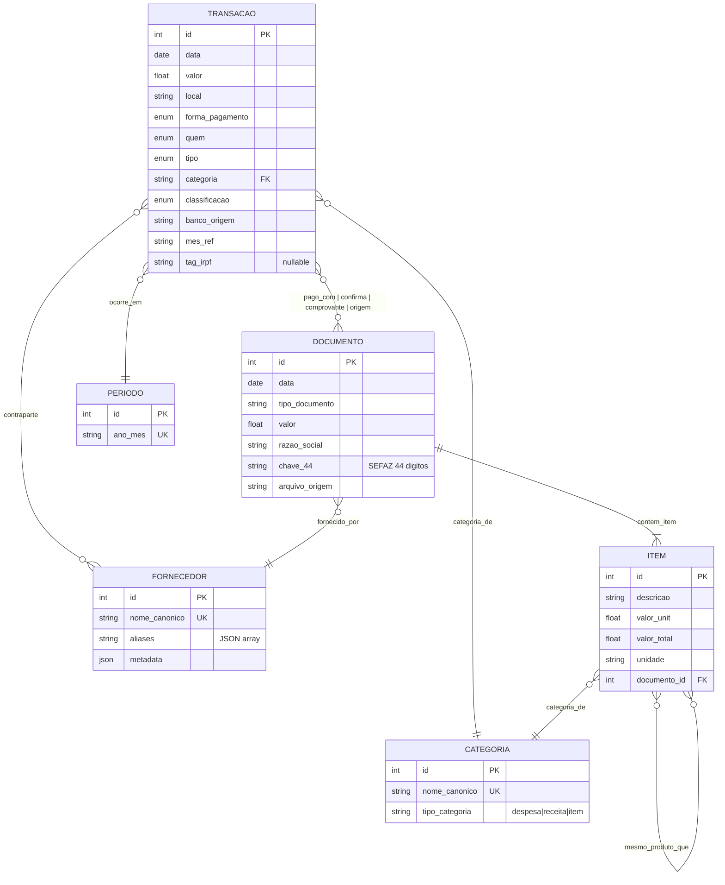

## 0. SPEC (machine-readable)

```yaml
sprint:
  id: 84
  title: "Schema ER relacional visual + doc de colunas/tabelas padronizadas"
  touches:
    - path: docs/SCHEMA_RELACIONAL.md
      reason: "novo: doc canônico de todas as tabelas/colunas/tipos"
    - path: docs/assets/schema_er.mmd
      reason: "novo: fonte mermaid do diagrama (embeddavel em Obsidian e GitHub)"
    - path: docs/assets/schema_er.svg
      reason: "gerado (se mermaid-cli ou graphviz disponível); fallback: ausente"
    - path: scripts/gerar_schema_diagrama.py
      reason: "novo: lê SQLite + XLSX + gera .mmd + tenta exportar .svg/.png"
    - path: src/dashboard/paginas/schema.py
      reason: "nova aba 'Schema' embute diagrama + tabelas"
    - path: src/dashboard/app.py
      reason: "registrar aba nova"
    - path: tests/test_schema_consistencia.py
      reason: "valida drift entre código, XLSX e doc"
  n_to_n_pairs:
    - ["colunas reais do extrato", "docs/SCHEMA_RELACIONAL.md §extrato"]
    - ["tipos canônicos em src/graph/__init__.py", "docs/SCHEMA_RELACIONAL.md §Grafo"]
  forbidden:
    - "Depender obrigatoriamente de npx/node (usar apenas como fallback)"
  tests:
    - cmd: "make lint"
      timeout: 60
    - cmd: ".venv/bin/pytest tests/test_schema_consistencia.py -v"
      timeout: 60
    - cmd: ".venv/bin/python scripts/gerar_schema_diagrama.py --dry-run"
      timeout: 30
  acceptance_criteria:
    - "docs/SCHEMA_RELACIONAL.md documenta 100% das 12 colunas da aba extrato + 7 colunas da aba renda + demais"
    - "docs/assets/schema_er.mmd existe com sintaxe mermaid válida (erDiagram)"
    - "GitHub renderiza o .mmd automaticamente quando visualizado (nativo desde 2022)"
    - "Obsidian renderiza o .mmd automaticamente (nativo via plugin Mermaid)"
    - "Script tenta exportar SVG/PNG via mermaid-cli; se não disponível, loga warning e continua"
    - "Teste automatizado: colunas reais do XLSX == colunas listadas em SCHEMA_RELACIONAL.md"
    - "Aba Schema no dashboard mostra o diagrama embebido como SVG (se existir) ou como bloco mermaid via biblioteca Python (streamlit-mermaid)"
    - "Cada coluna documentada: nome, tipo, obrigatório/opcional, fonte (módulo que popula), consumidores"
  proof_of_work_esperado: |
    .venv/bin/python scripts/gerar_schema_diagrama.py
    ls -la docs/assets/schema_er.mmd
    .venv/bin/pytest tests/test_schema_consistencia.py -v
```

---

# Sprint 84 — Schema ER relacional visual

**Status:** BACKLOG
**Prioridade:** P1
**Dependências:** Sprints 42 (grafo), 50 (categorização), 68b (TI fix), 82 (canonicalizer). Schema precisa estar estável antes de documentar.
**Issue:** CLAREZA-01

## Problema

Andre perguntou: "nome de colunas e tabelas tão padronizado? Acho que seria legal uma imagem de um banco de dados relacional. No output?".

Hoje:
- XLSX tem 8 abas, cada uma com colunas próprias declaradas em CLAUDE.md.
- Grafo SQLite tem `node` + `edge` com schema extensível (ADR-14).
- Tipos canônicos distribuídos: `src/graph/__init__.py`, ADR-14, CLAUDE.md.
- Zero documento único que liste TUDO.
- Zero diagrama visual.

## Contexto técnico (LEITURA OBRIGATÓRIA)

### Mermaid: escolha canônica

Mermaid é a linguagem de diagrama mais suportada no ecossistema Markdown. Três renderizadores gratuitos:

1. **GitHub** renderiza `erDiagram` mermaid **nativamente** desde 2022 dentro de blocos ` ```mermaid ` em arquivos .md. **Zero config.**
2. **Obsidian** renderiza com o plugin nativo Mermaid (padrão, já ativado).
3. **Streamlit** não renderiza mermaid nativo. Opções:
   - `streamlit-mermaid` (biblioteca pequena, ativamente mantida).
   - Embed de SVG estático (gerado uma vez).
   - iframe apontando para um renderer público (descartado, exige internet).

**Decisão:** escrever o schema em mermaid `.mmd`, embed no .md via bloco mermaid (funciona em GitHub + Obsidian), e NO dashboard Streamlit usar `streamlit-mermaid` OU SVG estático se mermaid-cli disponível.

### Sintaxe mermaid erDiagram



GitHub / Obsidian renderizam isso automaticamente ao abrir o .md.

### Script de geração

```python
# scripts/gerar_schema_diagrama.py
"""Gera docs/assets/schema_er.mmd lendo schema real do XLSX + grafo SQLite.

Tenta exportar SVG/PNG via mermaid-cli se disponível. Sem falha dura se não.
"""
from __future__ import annotations
import argparse
import json
import shutil
import subprocess
import sys
from pathlib import Path

import pandas as pd

RAIZ = Path(__file__).resolve().parent.parent
SAIDA_MMD = RAIZ / "docs" / "assets" / "schema_er.mmd"
SAIDA_SVG = RAIZ / "docs" / "assets" / "schema_er.svg"
SAIDA_PNG = RAIZ / "docs" / "assets" / "schema_er.png"
XLSX = RAIZ / "data" / "output" / "ouroboros_2026.xlsx"

TEMPLATE_MMD = """\
erDiagram
    TRANSACAO {
{campos_transacao}
    }}
    DOCUMENTO {
{campos_documento}
    }}
    FORNECEDOR {
{campos_fornecedor}
    }}
    CATEGORIA {
{campos_categoria}
    }}
    ITEM {
{campos_item}
    }}
    PERIODO {
{campos_periodo}
    }}

    TRANSACAO }o--|| CATEGORIA : categoria_de
    TRANSACAO }o--|| PERIODO : ocorre_em
    TRANSACAO }o--o{ FORNECEDOR : contraparte
    TRANSACAO }o--o{ DOCUMENTO : "pago_com | confirma | comprovante | origem"
    DOCUMENTO ||--|{ ITEM : contem_item
    DOCUMENTO }o--|| FORNECEDOR : fornecido_por
    ITEM }o--|| CATEGORIA : categoria_de
    ITEM }o--o{ ITEM : mesmo_produto_que
"""


def _campos_from_xlsx(aba: str) -> str:
    if not XLSX.exists():
        return "        string placeholder"
    df = pd.read_excel(XLSX, sheet_name=aba, nrows=1)
    linhas = []
    for col in df.columns:
        if col.startswith("_"):
            continue  # interno
        tipo = _tipo_mermaid(df[col].dtype)
        linhas.append(f"        {tipo} {col}")
    return "\n".join(linhas)


def _tipo_mermaid(dtype) -> str:
    nome = str(dtype)
    if "int" in nome:
        return "int"
    if "float" in nome:
        return "float"
    if "date" in nome or "datetime" in nome:
        return "date"
    return "string"


def gerar_mmd() -> Path:
    SAIDA_MMD.parent.mkdir(parents=True, exist_ok=True)
    conteudo = TEMPLATE_MMD.format(
        campos_transacao=_campos_from_xlsx("extrato"),
        campos_documento="        int id PK\n        date data\n        string tipo_documento\n        float valor\n        string razao_social",
        campos_fornecedor="        int id PK\n        string nome_canonico UK\n        string aliases\n        json metadata",
        campos_categoria="        int id PK\n        string nome_canonico UK\n        string tipo_categoria",
        campos_item="        int id PK\n        string descricao\n        float valor_unit\n        float valor_total\n        string unidade",
        campos_periodo="        int id PK\n        string ano_mes UK",
    )
    SAIDA_MMD.write_text(conteudo, encoding="utf-8")
    return SAIDA_MMD


def tentar_exportar_svg():
    """Tenta mermaid-cli -> graphviz python -> warning silencioso."""
    if shutil.which("mmdc"):
        try:
            subprocess.run(
                ["mmdc", "-i", str(SAIDA_MMD), "-o", str(SAIDA_SVG),
                 "-b", "transparent", "-t", "dark"],
                check=True, timeout=30,
            )
            subprocess.run(
                ["mmdc", "-i", str(SAIDA_MMD), "-o", str(SAIDA_PNG),
                 "-b", "transparent", "-t", "dark", "-w", "1800"],
                check=True, timeout=30,
            )
            print(f"OK: SVG + PNG gerados em {SAIDA_SVG.parent}")
            return True
        except subprocess.CalledProcessError as e:
            print(f"AVISO: mmdc falhou ({e}). .mmd ainda está disponível.")
            return False
    elif shutil.which("npx"):
        try:
            subprocess.run(
                ["npx", "-y", "@mermaid-js/mermaid-cli",
                 "-i", str(SAIDA_MMD), "-o", str(SAIDA_SVG)],
                check=True, timeout=60,
            )
            return True
        except subprocess.CalledProcessError:
            return False
    print("AVISO: mermaid-cli (mmdc) não encontrado. "
          "Instale via 'npm install -g @mermaid-js/mermaid-cli' para gerar SVG/PNG. "
          "O arquivo .mmd é renderizável em GitHub e Obsidian nativamente.")
    return False


def main():
    parser = argparse.ArgumentParser()
    parser.add_argument("--dry-run", action="store_true")
    args = parser.parse_args()

    mmd = gerar_mmd()
    print(f"Gerado: {mmd}")
    if args.dry_run:
        return 0
    tentar_exportar_svg()
    return 0


if __name__ == "__main__":
    sys.exit(main())
```

### Aba Schema no dashboard

```python
# src/dashboard/paginas/schema.py
from pathlib import Path
import streamlit as st

RAIZ = Path(__file__).resolve().parent.parent.parent.parent
MMD = RAIZ / "docs" / "assets" / "schema_er.mmd"
SVG = RAIZ / "docs" / "assets" / "schema_er.svg"

def renderizar():
    st.header("Schema do Sistema")
    st.caption("Modelo canônico de dados. Toda mudança de schema passa por aqui.")

    if SVG.exists():
        st.image(str(SVG), use_column_width=True)
    elif MMD.exists():
        # Fallback: bloco mermaid via streamlit-mermaid se disponível
        try:
            from streamlit_mermaid import st_mermaid
            st_mermaid(MMD.read_text())
        except ImportError:
            # Último fallback: mostrar código .mmd + link
            st.code(MMD.read_text(), language="mermaid")
            st.info(
                "Para renderizar visualmente no dashboard, instale `streamlit-mermaid`. "
                "GitHub e Obsidian já renderizam este arquivo nativamente."
            )
    else:
        st.warning("schema_er.mmd não encontrado. Rode `scripts/gerar_schema_diagrama.py`.")

    st.divider()
    st.subheader("Documentação detalhada")
    doc = RAIZ / "docs" / "SCHEMA_RELACIONAL.md"
    if doc.exists():
        st.markdown(doc.read_text())
```

### Teste de consistência (anti-drift)

```python
# tests/test_schema_consistencia.py
from pathlib import Path
import pandas as pd

XLSX = Path("data/output/ouroboros_2026.xlsx")
DOC = Path("docs/SCHEMA_RELACIONAL.md")

def test_colunas_extrato_batem_com_doc():
    if not XLSX.exists():
        import pytest
        pytest.skip("XLSX não existe (rodar ./run.sh --tudo antes)")
    df = pd.read_excel(XLSX, sheet_name="extrato", nrows=1)
    doc = DOC.read_text()
    for col in df.columns:
        if col.startswith("_"):
            continue
        assert f"| {col} |" in doc, f"Coluna {col} do XLSX não está em SCHEMA_RELACIONAL.md"

def test_tipos_grafo_batem_com_adr14():
    adr14 = Path("docs/adr/ADR-14-grafo-sqlite-extensivel.md").read_text()
    from src.graph import TIPOS_CANONICOS  # se existe
    for tipo in TIPOS_CANONICOS:
        assert tipo in adr14, f"Tipo {tipo} não documentado em ADR-14"
```

## Conteúdo de `docs/SCHEMA_RELACIONAL.md` (esqueleto obrigatório)

Texto inicial que a sprint deve escrever:

```markdown
# Schema Relacional — Protocolo Ouroboros

Documento canônico de todas as tabelas, colunas e relações. Toda mudança de schema
deve atualizar este arquivo E passar pelo teste `tests/test_schema_consistencia.py`.

## Diagrama

```mermaid
{{ conteúdo de docs/assets/schema_er.mmd }}
```

## XLSX: `data/output/ouroboros_2026.xlsx`

### Aba `extrato` (tabela principal, ~6.000 linhas)

| Coluna | Tipo | Obrigatório | Fonte (módulo) | Consumidores |
|---|---|---|---|---|
| data | date | sim | normalizer | dashboard, grafo, relatorio |
| valor | float | sim | extratores | tudo |
| forma_pagamento | enum {Pix, Débito, Crédito, Boleto, Transferência} | sim | normalizer | filtro sidebar, relatorio |
| local | str | sim | extrair_local() | dashboard, canonicalizer_fornecedor |
| quem | enum {André, Vitória, Casal} | sim | inferir_pessoa | filtro, relatorio |
| categoria | str | sim | categorizer | dashboard, IRPF |
| classificacao | enum {Obrigatório, Questionável, Supérfluo} OU NaN | sim se Despesa/Imposto, NaN outros | categorizer (Sprint 67) | dashboard |
| banco_origem | str | sim | extrator | dedup, relatorio |
| tipo | enum {Despesa, Receita, Transferência Interna, Imposto} | sim | normalizer + canonicalizer_casal | tudo |
| mes_ref | str YYYY-MM | sim | normalizer | dashboard, IRPF |
| tag_irpf | str ou NaN | não | irpf_tagger | IRPF |
| obs | str ou NaN | não | manual / override | dashboard (NaN virou — na Sprint 64) |

### Aba `renda`
...

### Aba `dividas_ativas` (snapshot histórico 2023, congelada)
...

## Grafo SQLite: `data/output/grafo.sqlite`

### Tabela `node`

| Coluna | Tipo SQL | Descrição |
|---|---|---|
| id | INTEGER PK | Auto |
| tipo | TEXT | Enum fechado, ver abaixo |
| nome_canonico | TEXT | Identificador único dentro do tipo |
| aliases | TEXT (JSON array) | Variantes conhecidas |
| metadata | TEXT (JSON object) | Dados adicionais dependendo do tipo |
| created_at | TEXT ISO | Timestamp |

#### Tipos canônicos (fechados, ADR-14)

- `transacao`, `documento`, `item`, `fornecedor`, `categoria`, `conta`, `periodo`
- `tag_irpf`, `prescricao`, `garantia`, `apolice`, `seguradora`

### Tabela `edge`

| Coluna | Tipo SQL | Descrição |
|---|---|---|
| id | INTEGER PK | Auto |
| src_id | INTEGER FK node | Origem |
| dst_id | INTEGER FK node | Destino |
| tipo | TEXT | Enum (ver abaixo) |
| peso | REAL | Confiança ou valor |
| evidencia | TEXT (JSON) | Motivo/origem da aresta |
| created_at | TEXT ISO | Timestamp |

#### Tipos de aresta ativos

Por domínio:
- **Transação ↔ contexto:** `categoria_de`, `ocorre_em`, `origem`, `contraparte`, `irpf`
- **Documento ↔ conteúdo:** `contem_item`, `fornecido_por`, `emitida_por`, `vendida_em`
- **Documento ↔ transação (ADR-20, Sprint 74):** `pago_com`, `confirma`, `comprovante`, `origem`
- **Item ↔ item (Sprint 49):** `mesmo_produto_que`
- **Especializados:** `prescreve_cobre` (Sprint 47a), `assegura` (Sprint 47c)
```

## Armadilhas com solução

| Ref | Armadilha | Solução |
|---|---|---|
| A84-1 | `mmdc` (mermaid-cli) precisa de node | Script detecta e loga warning sem falhar |
| A84-2 | Streamlit não renderiza mermaid nativo | Tentar SVG estático primeiro; fallback streamlit-mermaid; último: mostrar código |
| A84-3 | Schema drift silencioso | Teste automatizado roda no gauntlet |
| A84-4 | `_campos_from_xlsx` lê XLSX que pode não existir em CI | Skip graceful |

## Evidências obrigatórias

- [ ] `docs/SCHEMA_RELACIONAL.md` completo (3 tabelas XLSX + grafo)
- [ ] `docs/assets/schema_er.mmd` existe e renderiza em GitHub (abrir preview na PR)
- [ ] Aba Schema no dashboard mostra algo (SVG OU bloco mermaid OU código)
- [ ] Teste de consistência verde
- [ ] Script aceita `--dry-run` sem exigir mermaid-cli

---

*"Schema explícito > schema implícito." — princípio"*
